# BUILD-PLAN.md — artupski.com Implementation Contract

Derived from [`docs/PLAN.md`](docs/PLAN.md) (authoritative spec, 3513 lines). This file is the implementation contract: every later task follows it. Where the spec was ambiguous, a `DECISION:` line records the call and the one-line rationale.

Non-negotiables inherited from the spec: server-render first, Turbo-enhance, Stimulus only when required, no SPA, no custom admin panel, no draft leakage, no unsanitized rich HTML, no over-engineering (§131 Rules 1–12).

---

## 1. Environment

Stack rows are **decided** by the owner and are not to be re-verified or looked up. Tool rows are **not detected** — the planning session has no shell, so detection is a Task 1 entry gate.

| Item | Detected version | Requirement | Status |
| --- | --- | --- | --- |
| PHP CLI | not detected | >= 8.3 | Task 1 must detect — blocker if < 8.3 |
| PHP ext `mbstring` | not detected | present | Task 1 must detect — blocker if missing |
| PHP ext `openssl` | not detected | present | Task 1 must detect — blocker if missing |
| PHP ext `pdo_mysql` | not detected | present | Task 1 must detect — blocker if missing |
| PHP ext `curl` | not detected | present | Task 1 must detect — blocker if missing |
| PHP ext `fileinfo` | not detected | present (MIME validation) | Task 1 must detect — blocker if missing |
| PHP ext `exif` | not detected | present (image orientation) | Task 1 must detect — blocker if missing |
| PHP ext `intl` | not detected | present (dates, slugs) | Task 1 must detect — blocker if missing |
| PHP ext `zip` | not detected | present (Composer) | Task 1 must detect — blocker if missing |
| PHP ext `gd` **or** `imagick` | not detected | at least one (medialibrary conversions) | Task 1 must detect — blocker if neither |
| Composer | not detected | 2.x | Task 1 must detect — blocker if absent |
| Node.js | not detected | >= 20 LTS | Task 1 must detect — blocker if absent |
| npm | not detected | ships with Node | Task 1 must detect — blocker if absent |
| MySQL server | not detected | >= 8.0 reachable | Task 1 must detect — blocker if absent |
| Git | not detected | any 2.x | Task 1 must detect — blocker if absent |
| Laravel | — | `13.30.1` | decided |
| Filament | — | `^5.0`, panel at `/tupasadmin` | decided |
| Frontend | — | Blade + Turbo + Stimulus + Tailwind + Vite | decided |
| Media | — | spatie/laravel-medialibrary | decided |
| Database engine | — | MySQL | decided |
| Test runner | — | Pest | decided |

### Task 1 detection commands (read-only)

```bash
php -v
php -m
composer -V
node -v
npm -v
mysql --version
git --version
```

Blocker rule: fail fast and report to the owner **only** for the conditions in the table above (PHP < 8.3, a missing required extension, no `gd`/`imagick`, or absent node/npm/composer/git/mysql). Do not gate on third-party package versions here — that is §2's install-time compat check.

DECISION: `imagick` is preferred over `gd` when both exist (better WebP/AVIF and colour handling); if only `gd` exists, set medialibrary's image driver to `gd` and drop AVIF from the conversion set.

---

## 2. Dependencies

### Composer

| Package | Constraint | Why |
| --- | --- | --- |
| `laravel/framework` | `^13.30.1` (via skeleton `laravel/laravel:13.30.1`) | Decided stack. Mandatory, never downgrade (§2). |
| `filament/filament` | `^5.0` | Admin panel, auth, CRUD, RichEditor (§4, §5). |
| `spatie/laravel-medialibrary` | resolve at install (no explicit constraint) | Media, conversions, reusable media records (§23, §104). |
| `symfony/html-sanitizer` | resolve at install | Sanitize editor HTML. Framework-agnostic Symfony component, allow-list based (§59, §71, Rule 7). |
| `hotwired-laravel/turbo-laravel` | resolve at install | Laravel-side Turbo: Turbo Stream responses, `turbo_stream()` helper, Blade directives, `TurboMiddleware` for redirect-status semantics (§35–§37). |
| `pestphp/pest` + `pestphp/pest-plugin-laravel` | resolve at install, `--dev` | Decided test runner (§85). |
| `laravel/pint` | ships with skeleton, `--dev` | Style. Already there; do not add another formatter. |
| `barryvdh/laravel-debugbar` | resolve at install, `--dev` | **OPTIONAL.** Query/N+1 inspection for the §115 audit. Remove before deploy if unwanted. |

### npm

| Package | Constraint | Why |
| --- | --- | --- |
| `@hotwired/turbo` | resolve at install | Turbo Drive/Frames/Streams on the client (§35). |
| `@hotwired/stimulus` | resolve at install | The only public-frontend JS framework (§38). |
| `tailwindcss` + `@tailwindcss/vite` | already in skeleton | Styling (§76). Do not reinstall if present. |
| `vite` + `laravel-vite-plugin` | already in skeleton | Build (§3). |
| `@tailwindcss/typography` | resolve at install, `-D` | Prose styling for rich content and code blocks (§55, §72). |

### Explicitly rejected (do not install)

| Rejected | Instead |
| --- | --- |
| `spatie/laravel-sitemap` | One controller + Blade view. We need custom include rules anyway (§57). |
| any RSS package | One controller + Blade view (§56). |
| `spatie/laravel-sluggable` | `Str::slug` inside a small `HasSlug` trait (§28). |
| `spatie/laravel-settings` | Single `site_settings` table (§21, see §4 below). |
| `spatie/laravel-missing-page-redirector` | `redirects` table + one middleware (§29). |
| Alpine.js | Stimulus only on the public frontend. Filament bundles its own Alpine, isolated to `/tupasadmin` (§39, §75). |
| any syntax-highlighting JS library | Tailwind-styled `<pre>` + Stimulus copy button (§72). Extension point: server-side highlighting later. |
| Turnstile / captcha package | Honeypot + rate limit in V1 (§32). Extension point: `ContactRequest` rule slot. |
| 2FA package | Use Filament 5's built-in MFA if the installed version exposes it; otherwise defer (§33). No third-party 2FA dependency. |

**Compat gate:** every non-Laravel-core package above (Filament, medialibrary, turbo-laravel, html-sanitizer, Pest plugins, debugbar) must have Laravel 13 compatibility confirmed by Task 1 **at install time** — Composer resolution failure or a `conflict` on `illuminate/*` is the signal. If a package cannot resolve against Laravel 13, do **not** downgrade Laravel (§2). Report it, and either wait, use a maintained fork, or drop the package and implement the minimum inline.

### Install command sequence (Task 1 runs exactly this)

Hazard: the workspace already contains `docs/`, so `composer create-project` into `.` aborts. Scaffold into a temp sibling directory and move the contents in.

```bash
# 1. scaffold into an EMPTY temp dir, then move into the workspace, preserving docs/
cd /d/Projects
composer create-project laravel/laravel:13.30.1 artupski-scaffold --no-interaction
cd artupski-scaffold
shopt -s dotglob
mv ./* /d/Projects/artupski.com-personal-portfolio/
cd /d/Projects/artupski.com-personal-portfolio
rmdir /d/Projects/artupski-scaffold

# 2. environment + key
cp .env.example .env    # only if the skeleton did not already create .env
php artisan key:generate
# then edit .env: APP_NAME, APP_URL, DB_DATABASE=artupski, DB_USERNAME, DB_PASSWORD, MAIL_*

# 3. admin panel
composer require filament/filament:"^5.0" --no-interaction
php artisan filament:install --panels
# edit the generated AdminPanelProvider: ->id('admin')->path('tupasadmin')

# 4. media, sanitizer, Turbo
composer require spatie/laravel-medialibrary --no-interaction
php artisan vendor:publish --tag="medialibrary-migrations"
php artisan vendor:publish --tag="medialibrary-config"
composer require symfony/html-sanitizer --no-interaction
composer require hotwired-laravel/turbo-laravel --no-interaction
php artisan turbo:install    # confirm exact signature from the package README at install time

# 5. tests + optional dev tooling
composer require --dev pestphp/pest pestphp/pest-plugin-laravel --no-interaction
php artisan pest:install
composer require --dev barryvdh/laravel-debugbar --no-interaction   # OPTIONAL

# 6. frontend
npm install
npm install @hotwired/turbo @hotwired/stimulus
npm install -D @tailwindcss/typography

# 7. verify the scaffold boots before writing any feature code
php artisan migrate
php artisan make:filament-user
npm run build
php artisan test
```

DECISION: install `hotwired-laravel/turbo-laravel` rather than hand-rolling Turbo Stream responses — the Turbo redirect-status middleware and stream response helpers are non-obvious to reimplement correctly, and §37 requires Streams. This is the one frontend-adjacent dependency that earns its place.

---

## 3. Directory layout

Conventional Laravel (§111). No DDD, no modules, no repository interfaces.

```text
app/
├── Console/Commands/
├── Http/
│   ├── Controllers/
│   │   ├── HomeController.php
│   │   ├── PageController.php
│   │   ├── ProjectController.php
│   │   ├── PostController.php
│   │   ├── ContactController.php
│   │   ├── FeedController.php
│   │   ├── SitemapController.php
│   │   ├── RobotsController.php
│   │   └── PreviewController.php
│   ├── Middleware/
│   │   ├── HandleRedirects.php
│   │   └── SecurityHeaders.php
│   └── Requests/ContactRequest.php
├── Models/            User Page Project Technology Post Category Tag ContactMessage Redirect SiteSetting NavigationItem
├── Models/Concerns/   HasSlug.php  HasPublishing.php  HasSeo.php
├── Observers/         PostObserver.php ProjectObserver.php PageObserver.php SettingsCacheObserver.php
├── Policies/          PostPolicy.php ProjectPolicy.php PagePolicy.php ContactMessagePolicy.php
├── Providers/         AppServiceProvider.php  Filament/AdminPanelProvider.php
├── Services/
│   ├── ContentRenderer.php     sanitize + block expansion, the ONLY place HTML is emitted raw
│   ├── SeoMetadata.php         fallback chain (§67)
│   ├── SettingsRepository.php  cached key/value accessor (§21)
│   └── ReadingTime.php         250 wpm (§46)
├── Queries/
│   ├── FeaturedProjects.php
│   ├── LatestPosts.php
│   └── RelatedPosts.php        same category + shared tags (§47)
├── Filament/
│   ├── Resources/   PageResource ProjectResource PostResource CategoryResource TagResource
│   │                TechnologyResource ContactMessageResource NavigationItemResource RedirectResource UserResource
│   ├── Pages/       Auth/Login.php (custom, §4)  ManageSiteSettings.php
│   ├── Widgets/     ContentStatsWidget.php  UnreadMessagesWidget.php  RecentActivityWidget.php
│   └── Forms/Components/ContentBlocks.php    the 5 starter blocks (§6)
└── View/Components/
    ├── Seo.php          <x-seo> (§70)
    └── RichContent.php  <x-rich-content> delegates to ContentRenderer
```

DECISION: `Services/` for stateful/reused logic, `Queries/` for read-model queries; no `Actions/` directory. §111 offered all three — two is enough for a one-developer site, and a query object is not an action.

### `resources/views` (spec §48)

```text
resources/views/
├── layouts/            app.blade.php  blog.blade.php  (guest.blade.php only if needed)
├── partials/           head.blade.php  header.blade.php  footer.blade.php  analytics.blade.php
├── components/
│   ├── ui/             button badge card container heading prose divider
│   ├── layout/         section page-header  (the layout primitives, not the layouts themselves)
│   ├── navigation/     nav-links mobile-menu breadcrumbs pagination theme-toggle
│   ├── cards/          project-card post-card
│   ├── content/        rich-content seo json-ld  blocks/{image,callout,cta,code,project-highlight}
│   ├── media/          responsive-image avatar gallery
│   ├── blog/           post-meta post-tags reading-time related-posts prev-next
│   └── projects/       tech-stack project-meta related-projects
├── home/               index.blade.php + sections/
├── pages/              show.blade.php
├── projects/           index.blade.php  show.blade.php
├── blog/               index.blade.php  show.blade.php
├── contact/            index.blade.php  _form.blade.php (turbo frame target)
├── feed/               rss.blade.php
├── sitemap/            index.blade.php
└── errors/             404 403 419 429 500 503 .blade.php
```

### `resources/js` / `resources/css`

```text
resources/
├── css/app.css                 Tailwind entry + @plugin typography + prose/code-block overrides
└── js/
    ├── app.js                  imports Turbo, boots Stimulus, registers controllers
    └── controllers/
        ├── mobile_menu_controller.js
        ├── theme_controller.js          light/dark/system, persisted (§52)
        ├── copy_code_controller.js      (§72)
        ├── reading_progress_controller.js
        └── lightbox_controller.js       OPTIONAL, only if a gallery needs it
```

Turbo lifecycle note (§87, §120): Stimulus auto-reconnects on Turbo navigation, so controllers must hold no module-level state. Theme must be applied by a tiny inline script in `<head>` before paint to avoid the §52 flash — that inline script is the single exception to "all JS lives in `resources/js`".

Filament assets stay inside the `/tupasadmin` panel and are never imported into `resources/js/app.js` (§75).

---

## 4. Database schema

MySQL 8. All tables `id` = `bigIncrements`, plus `timestamps` unless noted. Every FK gets an explicit index. Slug columns are `unique` per table (§27, §81).

### `users`

| Column | Type | Null | Key | Note |
| --- | --- | --- | --- | --- |
| id | bigint UN | no | PK | |
| name | varchar(255) | no | | |
| email | varchar(255) | no | unique | Filament login |
| email_verified_at | timestamp | yes | | skeleton default |
| password | varchar(255) | no | | hashed |
| role | enum | no | index | `super_admin`,`editor`,`author`; default `author` (§34) |
| avatar_path | varchar(255) | yes | | |
| remember_token | varchar(100) | yes | | |

Keep the skeleton migration; add `role` + `avatar_path` in a second migration. MFA columns come from Filament if its built-in MFA is enabled — do not invent them.

### `pages`

| Column | Type | Null | Key | Note |
| --- | --- | --- | --- | --- |
| id | bigint UN | no | PK | |
| user_id | bigint UN | yes | FK users nullOnDelete | author (§44) |
| title | varchar(255) | no | | |
| slug | varchar(255) | no | unique | route binding |
| excerpt | varchar(500) | yes | | |
| content | longtext | yes | | sanitized HTML |
| content_blocks | json | yes | | starter blocks (§6) |
| status | enum | no | idx(status,published_at) | draft/scheduled/published/archived |
| published_at | timestamp | yes | ↑ composite | |
| is_navigable | boolean | no | | default true; false hides from nav/sitemap (§7 "disabled initially") |
| seo_title | varchar(255) | yes | | |
| seo_description | varchar(500) | yes | | |
| canonical_url | varchar(255) | yes | | |
| og_image_path | varchar(255) | yes | | fallback when no media |
| created_by / updated_by | bigint UN | yes | FK users nullOnDelete | audit (§90) |

### `projects`

| Column | Type | Null | Key | Note |
| --- | --- | --- | --- | --- |
| id | bigint UN | no | PK | |
| user_id | bigint UN | yes | FK users nullOnDelete | owner (§44) |
| title | varchar(255) | no | | |
| slug | varchar(255) | no | unique | |
| short_description | varchar(500) | yes | | card + meta description source |
| content | longtext | yes | | case-study body (§12) |
| content_blocks | json | yes | | |
| challenges / solutions / results | text | yes | | §11, plain text or light HTML |
| project_type | enum | no | index | website, web_application, cms, internal_tool, automation, ai_tool, saas, government, personal, open_source, other (§11) |
| client | varchar(255) | yes | | |
| role | varchar(255) | yes | | |
| started_on | date | yes | | |
| ended_on | date | yes | | null = ongoing |
| project_status | enum | no | | `in_progress`,`completed`,`maintained`,`archived` — the *work* status |
| status | enum | no | idx(status,published_at) | the *publishing* status |
| published_at | timestamp | yes | ↑ composite | |
| live_url | varchar(255) | yes | | validated http/https |
| repository_url | varchar(255) | yes | | |
| is_featured | boolean | no | idx(is_featured,sort_order) | §13 |
| sort_order | int | no | ↑ composite | default 0 |
| seo_title / seo_description / canonical_url / og_image_path | as `pages` | yes | | |
| created_by / updated_by | bigint UN | yes | FK users | |

DECISION: two separate status columns (`project_status` for delivery state, `status` for publishing). Overloading one enum would make the shared `scopePublished` unusable for projects.

### `technologies`

| Column | Type | Null | Key | Note |
| --- | --- | --- | --- | --- |
| id | bigint UN | no | PK | |
| name | varchar(255) | no | | |
| slug | varchar(255) | no | unique | |
| icon | varchar(255) | yes | | icon name or stored path |
| url | varchar(255) | yes | | |
| description | varchar(500) | yes | | |
| sort_order | int | no | index | default 0 |

### `project_technology`

| Column | Type | Null | Key | Note |
| --- | --- | --- | --- | --- |
| project_id | bigint UN | no | FK cascadeOnDelete, PK part | |
| technology_id | bigint UN | no | FK cascadeOnDelete, PK part | |

Composite primary key, no `id`, no timestamps. DECISION: table named `project_technology` (Laravel singular-alphabetical convention) even though §42 wrote `project_technologies` — the convention removes a needless `$table` override.

### `posts`

| Column | Type | Null | Key | Note |
| --- | --- | --- | --- | --- |
| id | bigint UN | no | PK | |
| user_id | bigint UN | no | FK users restrictOnDelete | author (§44) |
| category_id | bigint UN | yes | FK categories nullOnDelete | one category (§44) |
| project_id | bigint UN | yes | FK projects nullOnDelete | optional "built X" link (§93) |
| title | varchar(255) | no | | required (§66) |
| slug | varchar(255) | no | unique | required |
| excerpt | varchar(500) | yes | | SEO description fallback (§67) |
| content | longtext | no | | required, sanitized HTML |
| content_blocks | json | yes | | |
| status | enum | no | idx(status,published_at) | |
| published_at | timestamp | yes | ↑ composite | |
| reading_time | smallint UN | yes | | computed, 250 wpm (§46) |
| is_featured | boolean | no | idx(is_featured,published_at) | §16 |
| seo_title / seo_description / canonical_url / og_image_path | as `pages` | yes | | |
| created_by / updated_by | bigint UN | yes | FK users | |

DECISION: no `views_count` column. §62 forbids inventing analytics; counting views needs a write on every page render, which fights the caching in §6.

### `categories`

| Column | Type | Null | Key | Note |
| --- | --- | --- | --- | --- |
| id | bigint UN | no | PK | |
| name | varchar(255) | no | | |
| slug | varchar(255) | no | unique | |
| description | varchar(500) | yes | | |
| is_indexable | boolean | no | | default true; drives sitemap inclusion (§57) |
| sort_order | int | no | index | |

Flat, no `parent_id`. DECISION: §17 describes broad topics only; nested categories are an unused extension point.

### `tags`

| Column | Type | Null | Key | Note |
| --- | --- | --- | --- | --- |
| id | bigint UN | no | PK | |
| name | varchar(255) | no | | |
| slug | varchar(255) | no | unique | |
| is_indexable | boolean | no | | default **false** — tag pages excluded from sitemap unless flipped (§57) |

### `post_tag`

| Column | Type | Null | Key | Note |
| --- | --- | --- | --- | --- |
| post_id | bigint UN | no | FK cascadeOnDelete, PK part | |
| tag_id | bigint UN | no | FK cascadeOnDelete, PK part | |

### `media`

Owned by `spatie/laravel-medialibrary` — publish its migration unmodified, do not hand-write it. Relevant columns: `model_type`, `model_id`, `uuid`, `collection_name`, `name`, `file_name`, `mime_type`, `disk`, `size`, `manipulations`, `custom_properties`, `generated_conversions`, `responsive_images`, `order_column`.

Collections and conversions:

| Model | Collection | Single? | Conversions |
| --- | --- | --- | --- |
| Post / Page / Project | `featured` | yes | thumb 400w, medium 800w, large 1600w, og 1200x630 |
| Project | `gallery` | no | thumb, medium, large |
| Post / Page / Project | `og` | yes | og 1200x630 only |
| User | `avatar` | yes | thumb |
| SiteSetting | `logo`, `favicon`, `profile_photo`, `default_og` | yes | logo/profile: thumb+medium; favicon: none |

Five conversion names max, matching §23's "do not blindly generate dozens of sizes". Store `alt` in `custom_properties` (§53). Register conversions as queued (§79).

### `contact_messages`

| Column | Type | Null | Key | Note |
| --- | --- | --- | --- | --- |
| id | bigint UN | no | PK | |
| name | varchar(255) | no | | |
| email | varchar(255) | no | | validated |
| subject | varchar(255) | yes | | |
| message | text | no | | stored as plain text, never HTML |
| company | varchar(255) | yes | | optional (§31) |
| budget | varchar(100) | yes | | optional |
| project_type | varchar(100) | yes | | optional, free text (not the projects enum) |
| status | enum | no | idx(status,created_at) | `unread`,`read`,`replied`,`archived` (§31) |
| ip_hash | char(64) | yes | | sha256(ip + APP_KEY) for abuse triage; raw IP not stored (§98) |
| user_agent | varchar(255) | yes | | truncated |
| read_at / replied_at | timestamp | yes | | |

### `redirects`

| Column | Type | Null | Key | Note |
| --- | --- | --- | --- | --- |
| id | bigint UN | no | PK | |
| from_path | varchar(2048) | no | unique(prefix 191) | leading-slash-normalised, no host, no query |
| to_path | varchar(2048) | no | | internal path or absolute URL |
| status_code | smallint UN | no | | 301 or 302 only (§29) |
| is_active | boolean | no | index | |
| hits | int UN | no | | incremented on use; cheap enough |

`from_path` unique index needs an explicit prefix length under `utf8mb4`; use `varchar(191)` if MySQL rejects the prefixed unique index.

### `site_settings`

| Column | Type | Null | Key | Note |
| --- | --- | --- | --- | --- |
| id | bigint UN | no | PK | |
| group | varchar(64) | no | unique(group,key) | identity/personal/contact/social/seo/analytics (§21) |
| key | varchar(128) | no | ↑ composite | |
| value | text | yes | | scalar or JSON-encoded |
| type | varchar(32) | no | | `string`,`text`,`boolean`,`json`,`media` — drives cast + form field |

DECISION: **key/value rows, not typed columns.** §21 lists six groups that will keep growing (analytics providers, new socials); typed columns would mean a migration per new setting. Cost is loose typing, mitigated by the `type` column and a single cached `SettingsRepository` that returns casts. Media-backed settings store the medialibrary UUID in `value` with `type=media`.

### `navigation_items`

| Column | Type | Null | Key | Note |
| --- | --- | --- | --- | --- |
| id | bigint UN | no | PK | |
| label | varchar(255) | no | | |
| url | varchar(255) | no | | internal path or absolute URL |
| location | enum | no | idx(location,sort_order) | `header`,`footer` |
| target_blank | boolean | no | | |
| is_visible | boolean | no | ↑ | |
| sort_order | int | no | ↑ composite | |

Flat, no `parent_id` — §22 says do not over-engineer. Extension point: add `parent_id` when a dropdown is actually requested.

### Relationships

```text
User        hasMany Posts, Projects, Pages
Page        belongsTo User; morphMany Media
Project     belongsTo User; belongsToMany Technologies; hasMany Posts; morphMany Media
Technology  belongsToMany Projects
Post        belongsTo User, Category, Project (nullable); belongsToMany Tags; morphMany Media
Category    hasMany Posts
Tag         belongsToMany Posts
```

Standard eager-load sets (§82): post listing `['category','media']`; post detail `['category','author','tags','project','media']`; project listing `['technologies','media']`; project detail `['technologies','media','posts']`. Nothing wider.

### Publishing model (§45, §86)

`status` enum `draft` | `scheduled` | `published` | `archived`, plus nullable `published_at`. Applies identically to `pages`, `projects`, `posts` via the `HasPublishing` trait.

```php
// app/Models/Concerns/HasPublishing.php
public function scopePublished(Builder $query): Builder
{
    return $query->where('status', 'published')
                 ->whereNotNull('published_at')
                 ->where('published_at', '<=', now());
}

public function isPublished(): bool
{
    return $this->status === 'published'
        && $this->published_at !== null
        && $this->published_at->lessThanOrEqualTo(now());
}
```

Rules:
- Every public query and the sitemap/RSS go through `scopePublished()`. No hand-written status filters anywhere else.
- `scheduled` rows are invisible publicly even when `published_at` has passed, until a scheduler command flips them: `posts:publish-scheduled` runs every minute, sets `status='published'` where `status='scheduled' AND published_at <= now()`, and clears the affected caches (§80).
- `archived` is never public and never in the sitemap.
- The route binding uses `->published()` in the controller, **not** in the model's `booted()` global scope — a global scope would also hide drafts from Filament and from the signed preview route.
- Preview bypasses `scopePublished` only through the signed route in §5.

---

## 5. Routes

All public routes in `routes/web.php`. "Cacheable" = eligible for the §6 application cache and/or ETag/Last-Modified headers (§116).

| URI | Verb | Handler | Name | Cacheable |
| --- | --- | --- | --- | --- |
| `/` | GET | `HomeController@index` | `home` | yes |
| `/about` | GET | `PageController@about` | `about` | yes |
| `/projects` | GET | `ProjectController@index` | `projects.index` | yes |
| `/projects/{project:slug}` | GET | `ProjectController@show` | `projects.show` | yes |
| `/blog` | GET | `PostController@index` | `blog.index` | yes (per page+filter) |
| `/blog/{post:slug}` | GET | `PostController@show` | `blog.show` | yes |
| `/contact` | GET | `ContactController@create` | `contact.create` | no (CSRF token) |
| `/contact` | POST | `ContactController@store` | `contact.store` | no |
| `/now` | GET | `PageController@now` | `now` | yes |
| `/uses` | GET | `PageController@uses` | `uses` | yes |
| `/resume` | GET | `PageController@resume` | `resume` | yes |
| `/feed` | GET | `FeedController@index` | `feed` | yes |
| `/rss.xml` | GET | redirect 301 → `feed` | `feed.alias` | n/a |
| `/sitemap.xml` | GET | `SitemapController@index` | `sitemap` | yes |
| `/robots.txt` | GET | `RobotsController@index` | `robots` | yes |
| `/preview/post/{post}` | GET | `PreviewController@post` | `preview.post` | **never** |
| `/preview/project/{project}` | GET | `PreviewController@project` | `preview.project` | **never** |
| `/preview/page/{page}` | GET | `PreviewController@page` | `preview.page` | **never** |
| `/tupasadmin/*` | — | Filament `AdminPanelProvider` | panel `admin` | never |
| `/{page:slug}` | GET | `PageController@show` | `pages.show` | yes |

Notes:
- `/about`, `/now`, `/uses`, `/resume` are thin named aliases resolving a fixed slug through `PageController`, 404 if that page row is missing or unpublished. DECISION: register them explicitly instead of leaning on the catch-all, so `route('about')` exists, each can be disabled via `is_navigable`, and they always win over a same-slug page.
- Preview routes: `->middleware('signed')` **plus** an `auth` check in the controller; they render the public template with `<meta name="robots" content="noindex,nofollow">` and `Cache-Control: private, no-store` (§64).
- Blog filtering/search/pagination respond inside a Turbo Frame on the same `blog.index` route via query params (`?category=`, `?tag=`, `?q=`, `?page=`) — no separate AJAX endpoints (§35, §36, §83).
- `HandleRedirects` middleware: on a path that would 404, look up `redirects.from_path` and issue the stored 301/302 (§28, §29).
- No `/blog/category/{slug}` or `/blog/tag/{slug}` in V1 — filtering is query-param based. Extension point: add them when those pages are worth indexing.

**Catch-all ordering hazard:** `/{page:slug}` matches any single segment, so it must be the **last** route registered in `routes/web.php` — registered earlier it swallows `/projects`, `/blog`, `/contact`, `/feed`, `/robots.txt`, and every named alias.

---

## 6. Caching

Driver: `database` in local, `redis` in production if available, else `file` (§78 lists Redis as optional). Prefix every key with `art:`. Version-suffix nothing — invalidation is explicit.

| Cache key | What | TTL | Invalidated by |
| --- | --- | --- | --- |
| `art:settings` | full `site_settings` table as a group→key→value array | 24h | `SiteSetting` saved/deleted → `SettingsCacheObserver` |
| `art:nav:header` | visible header items ordered | 24h | `NavigationItem` saved/deleted |
| `art:nav:footer` | visible footer items ordered | 24h | `NavigationItem` saved/deleted |
| `art:home` | homepage view-model: featured projects, latest 3 posts, tech list | 1h | `PostObserver`, `ProjectObserver`, `TechnologyObserver`, `PageObserver` (home page row) |
| `art:projects:featured` | featured, published, ordered by `sort_order` | 6h | `ProjectObserver` |
| `art:posts:latest` | latest 5 published posts | 1h | `PostObserver` |
| `art:posts:featured` | featured published posts | 6h | `PostObserver` |
| `art:categories` | indexable categories + post counts | 12h | `CategoryObserver`, `PostObserver` (category change) |
| `art:tags` | tags with at least one published post | 12h | `TagObserver`, `PostObserver` |
| `art:related:post:{id}` | related post IDs (same category + shared tags) | 12h | `PostObserver` (any post save flushes the tagged group) |
| `art:sitemap` | rendered sitemap XML | 6h | `PostObserver`, `ProjectObserver`, `PageObserver` |
| `art:feed` | rendered RSS XML | 1h | `PostObserver` |
| `art:content:{model}:{id}:{updated_at_ts}` | sanitized+rendered HTML from `ContentRenderer` | 30d | key changes with `updated_at`, so no explicit bust needed |

Rules:
- One `ContentCache` helper holds every key string. No inline `Cache::remember('home', ...)` scattered in controllers.
- Observers call named flush methods (`ContentCache::flushPosts()`), never `Cache::flush()` — that would nuke sessions on a shared store.
- Blog listing pages are **not** application-cached (too many filter permutations); they get `ETag` + `Cache-Control: public, max-age=0, s-maxage=300` instead (§116).
- Nothing under `/tupasadmin`, `/contact`, or `/preview/*` is ever cached; those responses carry `Cache-Control: private, no-store` (§117).
- `php artisan config:cache route:cache view:cache` run at deploy (§78). Route caching is safe here because no route uses a closure — the catch-all included.
- Scheduled-publish command clears `art:home`, `art:posts:latest`, `art:posts:featured`, `art:sitemap`, `art:feed` after flipping any row.

---

## 7. Security checklist

Sources: §32, §33, §34, §59, §60, plus Rule 6 and Rule 7 (§131).

### Rich HTML sanitization — the load-bearing decision

DECISION: sanitize **on save**, with `symfony/html-sanitizer`, in a `SanitizesHtml` model concern hooked to the `saving` event, before the value is persisted. Rationale: the database then never holds hostile markup, the render path is a single cheap `{!! !!}` inside `ContentRenderer` (making the §6 render cache safe to store), and a sanitizer config change is a one-off backfill command rather than a permanent per-request cost.

Consequences that must be honoured:
- The sanitizer allow-list lives in `config/sanitizer.php` — headings, `p`, `strong`, `em`, `u`, `s`, `a[href|title|rel|target]`, `blockquote`, `ul`, `ol`, `li`, `code`, `pre`, `table`/`thead`/`tbody`/`tr`/`th`/`td`, `img[src|alt|width|height|loading]`, `figure`, `figcaption`, `hr`, `br`. Allowed URL schemes: `http`, `https`, `mailto`. `iframe` is **not** allowed — embeds go through the whitelisted-provider block, never raw editor iframes (§73).
- Links get `rel="nofollow noopener"` forced on external hosts.
- Raw `{!! !!}` appears in exactly **one** file, `resources/views/components/content/rich-content.blade.php`, rendering only already-sanitized `content`. Any other `{!! !!}` on user-editable data is a review failure (§71, Rule 7).
- `content_blocks` JSON is never rendered as HTML; each block renders through its own Blade component with escaped `{{ }}` fields, and the Code block emits escaped text inside `<pre>`.
- A `content:resanitize` artisan command re-runs the sanitizer over stored `content` after any allow-list change.

### Uploads (§60)

| Control | Rule |
| --- | --- |
| MIME | validate with `File::image()` / `mimetypes:image/jpeg,image/png,image/webp,image/avif,image/svg+xml`; SVG only for `favicon`/`logo` collections |
| Size | 4 MB images, 512 KB favicon/logo |
| Dimensions | reject > 6000px on either side before conversions run |
| Filename | medialibrary-generated names only; original filename stored as metadata, never used on disk |
| Location | `storage/app/public` via the `public` disk, symlinked; no uploads inside the webroot |
| Processing | conversions regenerate and strip EXIF; SVGs are sanitized or restricted to admin-only settings uploads |
| Extension check | reject double extensions (`x.php.jpg`) in the request rule |

### Contact form (§32)

- CSRF on the POST (Laravel default; Turbo submits carry the token).
- `throttle:5,1` per IP on `contact.store`, plus a per-email 1-per-5-minute check; 429 renders the custom error page.
- Honeypot: a field with a neutral name, visually hidden with CSS (not `type=hidden`), plus a `_started_at` timestamp — submissions faster than 2 seconds are silently dropped with a fake success response.
- `ContactRequest` validates: `name` required max 255, `email` required `email:rfc,dns` max 255, `subject` nullable max 255, `message` required min 20 max 5000, optional fields max-length only.
- `message` is stored and displayed as plain text; Filament shows it escaped, never in a rich viewer.
- Owner email is never printed in HTML — the contact page uses the form; any displayed address comes from settings and is rendered obfuscated.
- Extension point: a Turnstile rule slot in `ContactRequest` for when honeypot stops being enough.

### Admin auth & authorization (§33, §34)

- Filament panel at `/tupasadmin`, custom login page, registration disabled, password reset disabled in V1 (single owner; reset via `artisan`).
- `->authGuard('web')`, session-based; `throttle` on the login route; enable Filament's built-in MFA if the installed version provides it, otherwise defer with no third-party package.
- `User::canAccessPanel()` returns true only for `role in (super_admin, editor, author)` — the check is on the model, not on navigation visibility.
- Real policies for `Post`, `Project`, `Page`, `ContactMessage`; authors may only edit their own unpublished content, only `super_admin` and `editor` may publish or delete. Registered so Filament resources consult them (§34: "do not rely only on hiding navigation items").
- Mass assignment: `$fillable` on every model, never `$guarded = []`. `status`, `published_at`, `user_id`, `created_by`, `updated_by` are set server-side, not from request input.

### Response headers (`SecurityHeaders` middleware, §59)

| Header | Value |
| --- | --- |
| `Content-Security-Policy` | `default-src 'self'; img-src 'self' data:; style-src 'self' 'unsafe-inline'; script-src 'self'; frame-src` whitelisted embed hosts only; `object-src 'none'`; `base-uri 'self'`; `form-action 'self'` |
| `X-Content-Type-Options` | `nosniff` |
| `Referrer-Policy` | `strict-origin-when-cross-origin` |
| `X-Frame-Options` | `SAMEORIGIN` |
| `Permissions-Policy` | `camera=(), microphone=(), geolocation=()` |
| `Strict-Transport-Security` | `max-age=31536000; includeSubDomains` — production HTTPS only |

CSP applies to public routes; the Filament panel gets a relaxed policy (it needs inline scripts) or is excluded from the middleware group. `script-src` stays free of `'unsafe-inline'` on the public side — the one inline theme script uses a per-request nonce.

### Also required

- `.env` never committed; `.env.example` documents every variable with no real values (§77, §127).
- Logging never records passwords, tokens, session IDs, or full request bodies from `/contact` (§89).
- `APP_DEBUG=false` in production; custom `500`/`503` pages so stack traces never surface (§61).
- Redirect `to_path` values validated as internal paths or explicit absolute URLs — no open redirect via user-entered `to`.
- Preview URLs are signed and short-lived; drafts return `noindex` and are excluded from sitemap and RSS (Rule 6).

---

## 8. Build order

Eleven tasks. Each has an entry precondition and a definition of done. A task is not done until its DoD holds — no partial handoff.

**Task 1 — Scaffold**
Entry: §1 detection passed, no blockers. DoD: Laravel 13.30.1 installed with `docs/` preserved, `.env` configured, Filament panel reachable at `/tupasadmin`, all §2 packages installed with Laravel 13 compat confirmed, `npm run build` and `php artisan test` green, git repo initialized with remote `https://github.com/tupski/artupski-personal-portfolio.git` and an initial commit.

**Task 2 — Database**
Entry: Task 1 done. DoD: every §4 migration applied on a fresh `migrate:fresh`, models with `$fillable`, relationships, casts, and the `HasSlug`/`HasPublishing`/`HasSeo`/`SanitizesHtml` concerns; factories and seeders for the §106/§107 list producing realistic developer content (no lorem ipsum); `scopePublished` behaviour asserted by a test.

**Task 3 — Filament admin**
Entry: Task 2 done. DoD: all ten §100 resources CRUD-working with the §101–§103 form sections, RichEditor wired to the 5 starter blocks, medialibrary upload fields, custom login page, settings page, three dashboard widgets, policies enforced (author cannot publish), SEO preview panel present.

**Task 4 — Frontend foundation**
Entry: Task 3 done. DoD: Tailwind + typography configured, Turbo Drive active on real navigation, Stimulus booted with mobile menu + theme toggle working across Turbo navigations, dark mode with no flash, `layouts/app` + `layouts/blog`, and the §48 component tree stubbed with the `ui/`, `layout/`, `navigation/` primitives actually implemented. Design decisions come from the separate design contract, not invented here.

**Task 5 — Public pages**
Entry: Task 4 done. DoD: home, about, projects index/detail, blog index/detail with pagination + Turbo-Frame filtering/search, contact GET/POST, now, uses, resume, and the `/{page:slug}` catch-all registered last — all rendering database content with zero hard-coded copy, zero N+1 (verified by query count), and eager-load sets as specified in §4.

**Task 6 — SEO**
Entry: Task 5 done. DoD: `<x-seo>` on every page with the §67 fallback chain, canonicals, Open Graph, Twitter cards, JSON-LD for WebSite/Person/Blog/BlogPosting/BreadcrumbList, `/sitemap.xml` excluding drafts/scheduled/archived/admin, `/feed` with published posts only, `/robots.txt` disallowing `/tupasadmin` and `/preview`, and the `redirects` middleware issuing 301s on slug change.

**Task 7 — Contact**
Entry: Task 6 done. DoD: validation, rate limit, honeypot + timing check, message persisted, notification email queued, Turbo Frame success/error rendering, form still functional with JavaScript disabled, Filament inbox with read/replied/archive actions.

**Task 8 — Error pages, preview, caching**
Entry: Task 7 done. DoD: custom 404/403/419/429/500/503 matching the site design with the 404 helper content from §61; signed preview routes rendering drafts for authenticated users with `noindex`; every §6 cache key implemented through `ContentCache` with observers invalidating correctly, proven by a test that a post save clears the homepage cache.

**Task 9 — Tests**
Entry: Task 8 done. DoD: the full §86 critical list passing (draft/scheduled/archived not public, published public, slug change redirects, admin requires auth, contact validates, unauthorized cannot modify), plus feature tests for every §85 page, RSS, sitemap, SEO metadata, upload validation, and rate limiting. `php artisan test` green, no skipped tests.

**Task 10 — Security review & performance audit**
Entry: Task 9 done. DoD: every §7 checklist row verified in code with the exact file cited; a repo-wide grep confirms `{!! !!}` appears only in `rich-content.blade.php`; headers present on a real response; Lighthouse meets §40 targets (Perf 90+, A11y 95+, BP 95+, SEO 95+) on home, blog detail, project detail; query counts recorded per page (§115).

**Task 11 — Docs & push**
Entry: Task 10 done. DoD: `README.md` covering the §126 topics, `.env.example` complete with no real values, `CHANGELOG.md` optional, no secrets in history, all work pushed to a branch on the fixed remote and a PR opened — not pushed straight to `main`.

```mermaid
flowchart LR
    T1[1 Scaffold] --> T2[2 Database] --> T3[3 Filament admin] --> T4[4 Frontend foundation]
    T4 --> T5[5 Public pages] --> T6[6 SEO] --> T7[7 Contact] --> T8[8 Errors, preview, caching]
    T8 --> T9[9 Tests] --> T10[10 Security and perf review] --> T11[11 Docs and push]
```



---

## 9. Git convention

Conventional Commits. One commit per task in §8, subject in imperative mood, max 72 characters, no trailing period. Body lists what changed when the subject cannot carry it. Types in use: `feat`, `fix`, `test`, `perf`, `refactor`, `docs`, `chore`, `style`.

Examples:

```text
feat: scaffold Laravel 13 with Filament panel at /tupasadmin
feat(blog): add post CMS with scheduled publishing
test: cover draft and scheduled post visibility rules
```

Rules:
- Never commit `.env`, `storage/*`, `node_modules`, `vendor`, or build output.
- Never force-push, never rewrite pushed history.
- Task 11 pushes a branch and opens a PR; nothing lands directly on `main`.
- Remote is fixed: `https://github.com/tupski/artupski-personal-portfolio.git`. Task 1 owns `git init` and adding it — no earlier task touches git.
